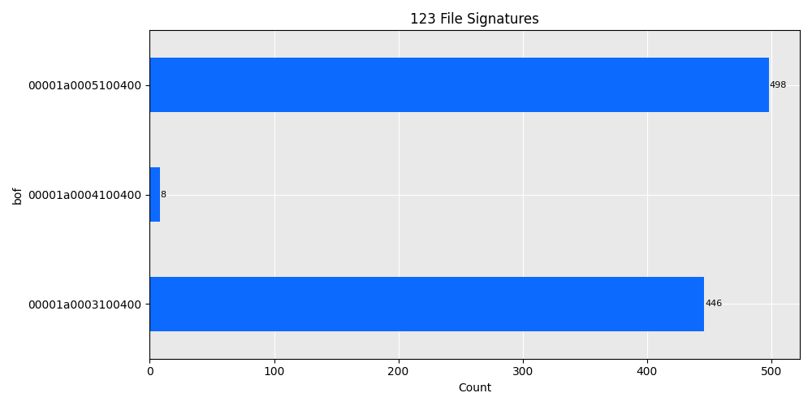
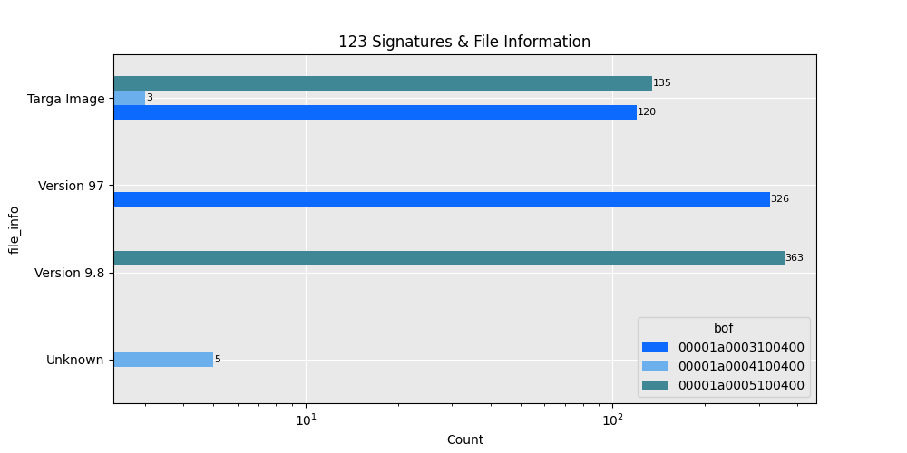
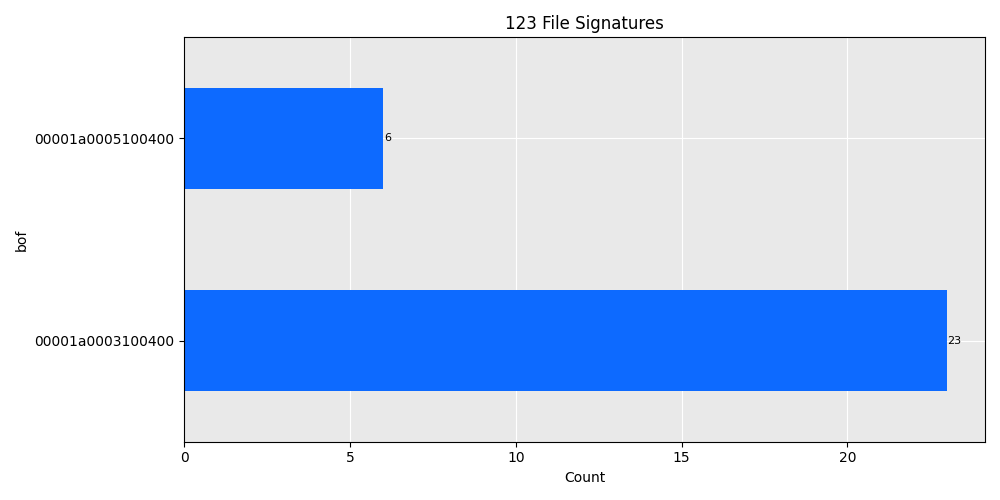

# Proposed new formats: Lotus 1-2-3 Worksheet Version 9.8 Millennium & Lotus 1-2-3 Worksheet Version 97
### Version 9.8 Millennium:
- Format name: Lotus 1-2-3 Worksheet
- PUID: aca-fmt/1 (placeholder)
- Version: Version 9.8 Millennium
- Signature: `00001a0005100400` from BOF with offset 0 - see [signature file](aca-fmt-1.xml)
- Extension: .123

### Version 97:
- Format name: Lotus 1-2-3 Worksheet
- PUID: aca-fmt/2 (placeholder)
- Version: 97
- Signature: `00001a0003100400` from BOF with offset 0 - see [signature file](aca-fmt-2.xml)
- Extension: .123

If these fit better under the same signature, please let me know.

## Reason for addition
We have a portion of .123 files in our digital records that have no corresponding PRONOM signature, see figure below.

Using `file` under Linux, it was possible to determine the specific Lotus 1-2-3 versions these files originate from. Note that the Targa Image identification comes from embedded images within the spreadsheet. The files with this identification are perfectly valid `.123` files. 

There is also a small subset of files with BOF signature `00001a0004100400`. However, we have been unable to determine the exact verison of Lotus 1-2-3 used for these files, and because there are so few we have not added them to a signature at this time.

## Example files
Due to data sensitivity, we are only able to provide 29 example files. Their BOF signatures are distributed as shown below.

The files are available [here](open_123.zip).

## Attribution
[Aarhus City Archives](https://www.aarhusstadsarkiv.dk/)