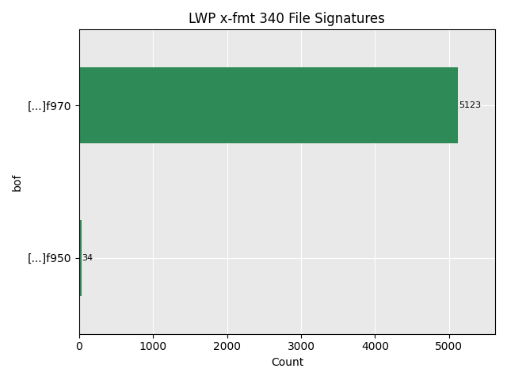

# Proposed changes for x-fmt/340 (Lotus WordPro Document)
- Format name: Lotus WordPro Document
- PUID: x-fmt/340
- Version: 96
- Signature: Updated, [see below](#signature)

## Reason for change
The current signature does not capture a large portion of the LWP files we work with at Aarhus City Archives. As shown in the figure below, most of our LWP version 96 files have the same signature as given x-fmt/340 *except* the last byte, which in our case is usually 70 instead of 50. Interestingly, 70 is ASCII lower case p, while 50 is ASCII upper case P.

Most of our data is sensitive, and as such we can only deliver [30 test files](open_lwp.zip). These all have the "new" signature.

## Signature

We propose a change to the signature for x-fmt/340 as follows:

`576F726450726F0DFB000000000000000005985C8172030040CCC1BFFFBDF9(50|70)`

The attached [signature file](lwp_96_pronom.xml) reflects this change.

## TNA Reference
We have previously contacted PRONOM with this proposed change. Our TNA reference is TNA1583762582J23.